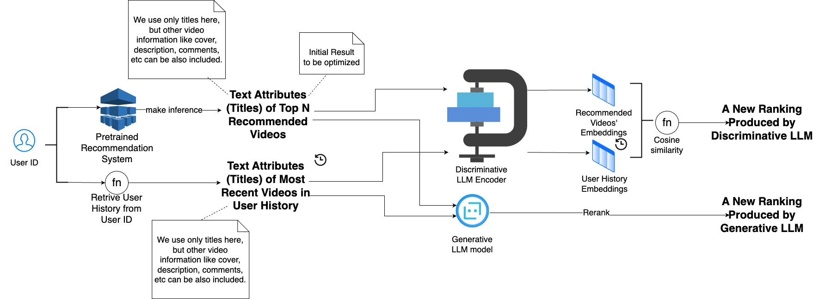

# Leveraging Large Language Models for Enhanced Recommendation Systems

**Authors:** Jiwei Liu, Logan Ju, Shoma Sawa, Roujia Wang  
**University of Michigan**

---

## Project Overview

This project explores the integration of state-of-the-art Large Language Models (LLMs) into modern recommendation systems, with a focus on short-form video platforms such as TikTok. We developed an extensible CLI pipeline that leverages both generative and discriminative LLMs for embedding generation and re-ranking, demonstrating significant improvements in recommendation accuracy and user engagement metrics.

## Key Achievements

- **Innovative LLM Integration:** Seamlessly combined generative and discriminative language models (OpenAI, HuggingFace) to enhance recommendation quality.
- **Flexible Data Enrichment:** Enabled dynamic inclusion of multimodal features (titles, covers, frames, comments) to enrich user-item representations.
- **Scalable Evaluation:** Designed a robust pipeline to evaluate hit rate improvements across various N values, supporting large-scale datasets (e.g., MicroLens-100k).
- **Open Source Impact:** Provided a modular, easy-to-extend codebase for the research and engineering community, with transparent documentation and reproducible experiments.
- **Real-World Relevance:** Demonstrated the effectiveness of LLM-powered re-ranking in realistic short-form video scenarios, paving the way for future advancements in personalized content delivery.

---



---

## Experimental Results


As shown in the table below, several discriminative LLMs and GPT-4o mini (a generative LLM) provide substantial improvements over strong DSSM baselines on key top-N hit rate metrics. These results demonstrate the effectiveness and flexibility of our LLM-powered re-ranking pipeline, showcasing its potential for advancing recommendation system performance with state-of-the-art language models.

| Baseline             | Model Variant                | Metric     | Baseline Value | Model Value | % Improvement |
|----------------------|-----------------------------|------------|---------------|-------------|--------------|
| IDRec DSSM (ours)    | e5-small-v2                  | Hits@5     | 40            | 49          | +22.50%      |
| IDRec DSSM (ours)    | all-MiniLM-L6-v2             | Hits@5     | 40            | 61          | +52.50%      |
| IDRec DSSM (ours)    | paraphrase-MiniLM-L12-v2     | Hits@5     | 40            | 49          | +22.50%      |
| IDRec DSSM (ours)    | all-distilroberta-v1         | Hits@5     | 40            | 59          | +47.50%      |
| IDRec DSSM (ours)    | GPT-4o mini (refined prompt) | Hits@5     | 40            | 58          | +45.00%      |
| VIDRec DSSM (ours)   | all-MiniLM-L6-v2             | Hits@5     | 42            | 44          | +4.76%       |
| VIDRec DSSM (ours)   | paraphrase-MiniLM-L12-v2     | Hits@5     | 42            | 45          | +7.14%       |
| VIDRec DSSM (ours)   | all-distilroberta-v1         | Hits@5     | 42            | 53          | +26.19%      |
| VIDRec DSSM (ours)   | text-embedding-3-small       | Hits@5     | 42            | 51          | +21.43%      |
| VIDRec DSSM (ours)   | all-distilroberta-v1         | Hits@10    | 78            | 93          | +19.23%      |
| VIDRec DSSM (ours)   | text-embedding-3-small       | Hits@10    | 78            | 85          | +8.97%       |
| VIDRec DSSM (ours)   | paraphrase-MiniLM-L12-v2     | Hits@10    | 78            | 86          | +10.26%      |
| VIDRec DSSM (ours)   | GPT-4o mini (refined prompt) | Hits@5     | 42            | 47          | +11.90%      |


---

# Recommendation System CLI Tool

This repository provides a CLI tool to evaluate and improve recommendation system performance using generative and discriminative models. The tool supports dynamic model selection, parameter configuration, and calculates hit rate improvements for different values of N.

---

## Features

- Parse and preprocess recommendation data.
- Support for both **generative** and **discriminative** models.
- Dynamic selection of model sources: **HuggingFace** or **OpenAI**.
- Flexible inclusion of additional data attributes (title, cover, frames, comments).
- Calculation of hit rate and its improvement for different N values.

---

## Requirements

- Python >= 3.7
- Required Python libraries:
  - `pandas`
  - `numpy`
  - `argparse`
  - `openai`
  - `requests`
  - `huggingface_hub`

Install the dependencies using:

```bash
pip install -r requirements.txt
```

Run the pipeline
```
python main.py \
    --inference_path "path_to_inference" \
    --pairs_path "MicroLens-100k_pairs.csv" \
    --titles_path "MicroLens-100k_title_en.csv" \
    --comments_path "MicroLens-100k_comment_en.txt" \
    --covers_path "path_to_covers" \
    --frames_path "path_to_frames" \
    --model_type "generative" \
    --model_source "huggingface" \
    --model_name "sentence-transformers/paraphrase-multilingual-MiniLM-L12-v2" \
    --hf_api_key "your_huggingface_api_key" \
    --openai_api_key "your_openai_api_key" \
    --include_title \
    --include_cover \
    --include_frames \
    --include_comments \
    --n_list 10 20 50
```